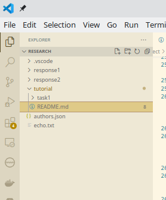
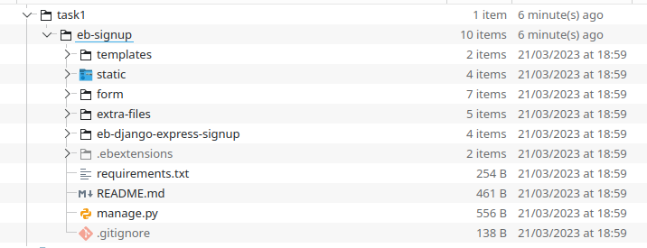
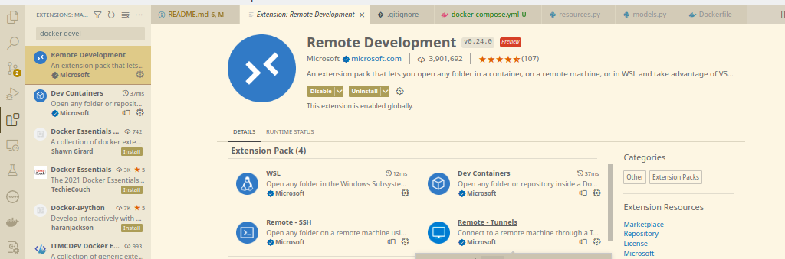
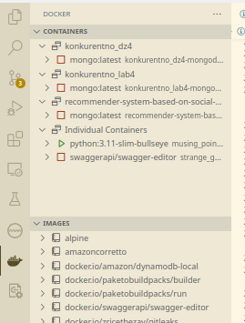
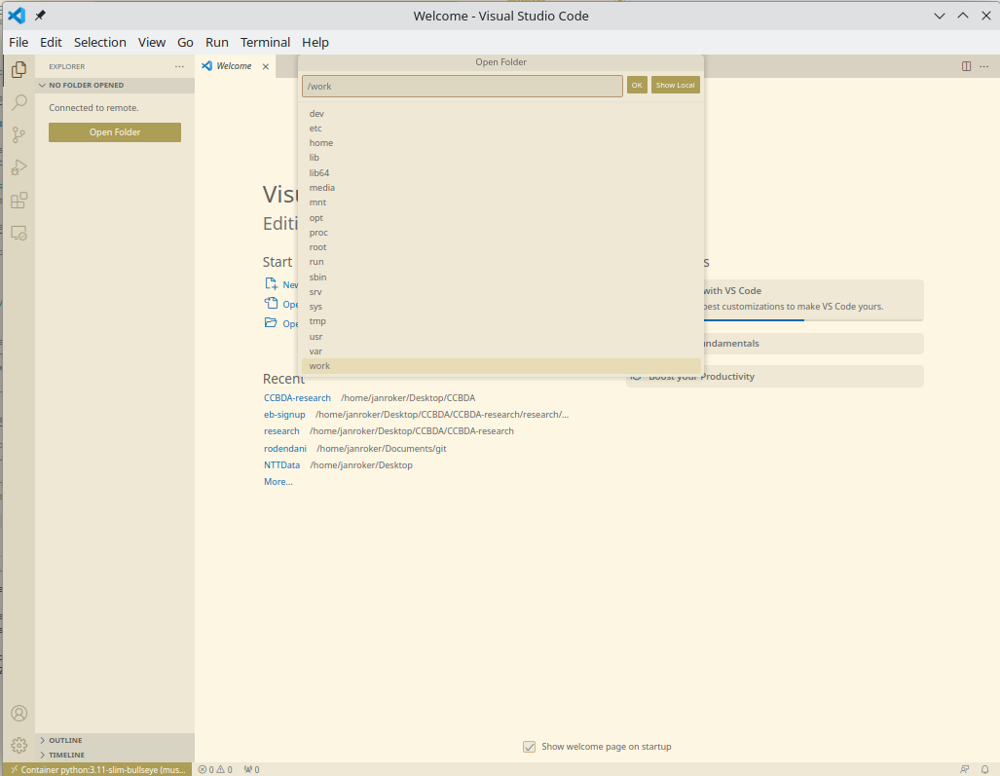

# Homework research project

In this tutorial we are going to leverage Docker to show how Docker and Docker containers can be used when developing, testing, managing and deploying applications. We will also use simple examples to show how we can use Kubernetes to deploy and manage our applications.

Lets begin by defining the tools that we are going to use.

## Docker

### What is Docker?

Docker is a platform for developing, shipping, and running applications in containers. It allows developers to **create, manage, and deploy containers** easily, regardless of the underlying infrastructure.

Docker has become a popular tool in DevOps and cloud computing, as it allows developers to build and test applications in a containerized environment, and deploy them to any cloud platform or on-premise infrastructure with ease. It also enables organizations to scale their applications more efficiently, as containers can be easily replicated and deployed across multiple environments.

### Containers

Containers are **lightweight**, **portable**, and **self-contained environments** that can run an application and all its dependencies, allowing developers to package their applications into a single container that can be deployed to any environment. Containers provide a way to isolate and run applications with all their dependencies in a consistent and predictable environment.

#### Containerization

Containerization is the process of packaging an **application and its dependencies** into a single, **self-contained** unit called a container.

By packaging the applications into containers:

- Applications can be abstracted from the environment in which they actually run
- Application's environment and host's environment are **decoupled**
- A **predictable environment**, that is **isolated** from the rest of the applications and can be run anywhere, is created

In the context of Docker, containerization involves using Docker containers to package an application and all its dependencies into a single **container image**. A Docker container image is a lightweight, portable, and self-sufficient package that contains everything needed to run an application, including the **code, runtime, system tools, libraries, and settings**.

#### Image vs container

To clarify, Docker **images and containers are different things**. Both containers and images allow users to specify application dependencies and configurations and to describe everything necessary for a machine to run that application. However, containers and images have different lifecycles:

- **Docker image** - read-only template containing instructions for creating a container
- **Docker container** - instance of a docker image, running on a completely isolated environment

#### What are the benefits?

Docker containers are based on the concept of operating system virtualization, which allows multiple containers to run on the same host operating system while remaining isolated from each other. Each Docker container runs as a **separate process**, with its own **file system, network interface, and resources, such as CPU and memory**.

The benefits of containerization with Docker include:

- **Portability**: Docker containers can be run on any platform that supports Docker, making it easy to move applications between environments.
- **Consistency**: Docker containers provide a consistent environment for applications to run, regardless of the underlying infrastructure.
- **Efficiency**: Docker containers are lightweight and require minimal resources, allowing for efficient use of infrastructure.
- **Scalability**: Docker containers can be easily replicated and deployed across multiple environments, enabling organizations to scale their applications more efficiently.

### Where is it used?

Overall, containerization with Docker provides a more efficient and reliable way to develop, deploy, and manage applications.

Docker is commonly used in cloud-native applications, microservices architectures, and container orchestration platforms like Kubernetes. It is also used in DevOps workflows, where developers use Docker containers to build, test, and deploy applications in a consistent and repeatable way.

Due to these benefits, containers (& Docker) have seen widespread adoption. Companies like Google, Facebook, Netflix and Salesforce leverage containers to make large engineering teams more productive and to improve utilization of compute resources.

### docker-compose

Docker Compose is a tool that allows you to define and run **multi-container Docker applications** (containerized applications that are made of multiple containers). It is used to define the **services** that make up your application and how they interact with each other. With Docker Compose, you can configure, start, and stop multiple Docker containers with a **single command**.

The main purpose of Docker Compose is to simplify the process of managing multi-container Docker applications. With Docker Compose, you can define your application as a **set of services**, each running in its own container, and **configure how these services interact** with each other.

A **Docker Compose file** is a YAML file that defines the configuration of the services that make up your application. It includes information such as **image** to use for each service, **ports to expose**, and **environment variables** to set. You can also define **network connections between containers**, **mount volumes for persistent data**, and set up **dependencies between services**.

Docker Compose is particularly useful for developing and testing complex applications, as it allows you to define and run the entire application stack on your local machine. This makes it easier to test changes and debug issues in a local environment that closely mirrors the production environment.

## Kubernetes

### What is Kubernetes?

Kubernetes is an open-source **container orchestration platform** that automates the deployment, scaling, and management of containerized applications. Kubernetes was originally developed by Google, and it has since become one of the most popular tools in cloud computing and DevOps.

Kubernetes is often used in conjunction with Docker, as **Docker provides the containerization technology that Kubernetes uses to run applications**. Kubernetes can also work with other containerization tools like containerd, CRI-O, and rkt.

Kubernetes is commonly used in cloud-native applications and microservices architectures, as it provides a way to manage and scale complex containerized applications. It is widely used in cloud platforms like AWS, Microsoft Azure, and Google Cloud Platform, as well as in on-premise data centers.

### Benefits

Some of the benefits of using Kubernetes include:

- **Scalability**: Kubernetes enables organizations to scale their applications up or down based on demand, making it easy to handle traffic spikes and other fluctuations.
- **Resilience**: Kubernetes provides features like self-healing and automatic failover, ensuring that applications remain available even in the face of hardware or software failures.
- **Portability**: Kubernetes provides a consistent way to deploy and manage applications across different environments, making it easy to move applications between cloud platforms and on-premise infrastructure.
- **Automation**: Kubernetes automates many of the tasks involved in managing containerized applications, reducing the need for manual intervention and minimizing the risk of human error.

### Challenges

Some of the potential drawbacks include:

- **Complexity**: Kubernetes can be complex to set up and manage, especially for organizations that are new to containerization and cloud computing.
- **Learning curve**: Kubernetes has a steep learning curve, and it can take time for developers and operations teams to become proficient in its use.
- **Resource requirements**: Kubernetes requires significant resources to run, both in terms of hardware and personnel. Organizations need to have dedicated teams and infrastructure in place to manage and maintain Kubernetes clusters.

Overall, Kubernetes is a powerful tool for managing containerized applications, and it is widely used in cloud computing and DevOps. However, organizations need to carefully consider the benefits and drawbacks of using Kubernetes before adopting it in their workflows.

### General Kubernetes terminology

Here are some common terms used in Kubernetes environment:

1. **Pod**: A pod is the smallest deployable unit in Kubernetes. It is a logical host for one or more containers and provides a shared namespace for communication between them.
2. **Node**: A node is a physical or virtual machine that is part of a Kubernetes cluster. Pods are scheduled onto nodes, and each node can run multiple pods.
3. **Container**: A container is a lightweight, portable executable that encapsulates an application and its dependencies. Containers are typically deployed inside pods.
4. **Deployment**: A deployment is a higher-level Kubernetes object that manages a set of replicas of a pod template. Deployments make it easy to scale, update, and rollback applications.
5. **Scaling**: Scaling refers to the process of increasing or decreasing the number of replicas of a pod or deployment to meet changing demand. Kubernetes provides horizontal scaling, which means adding or removing pods rather than scaling up individual containers.
6. **Service**: A service is an abstraction layer that provides a stable IP address and DNS name for a set of pods. Services allow pods to be accessed by other pods or external clients, regardless of their current IP addresses.
7. **Load balancer**: A load balancer is a Kubernetes resource that distributes incoming network traffic across multiple pods. Load balancers are typically used to provide high availability and scalability for web applications.
8. **Worker node**: A worker node is a node in a Kubernetes cluster that runs pods. Worker nodes are responsible for running the workload, and they communicate with the master node to receive instructions and report status.
9. **Master node**: A master node is a node in a Kubernetes cluster that manages the overall state of the cluster. It is responsible for scheduling pods onto worker nodes, monitoring their status, and managing the cluster's resources.
10. **Ingress**: Ingress is a Kubernetes resource that allows external traffic to be routed to services within the cluster. Ingress can provide features like SSL termination, URL rewriting, and load balancing for HTTP and HTTPS traffic.
    
[Here](https://kubernetes.io/docs/concepts/overview/components/) you can find out more about the Kubernetes Components.

[Here](https://landscape.cncf.io/) you can see the CNCF (Cloud Native Interactive Landscape) which shows the different open-source projects and commercial products that make up the cloud native ecosystem. It provides a comprehensive overview of the cloud native landscape, including technologies related to containers, orchestration, networking, security, storage, monitoring, logging, and more, all commonly used with Kubernetes.

## Kind (Kubernetes in Docker)

Kind (Kubernetes in Docker) is a tool for running _local Kubernetes clusters using Docker container nodes_. It allows users to **easily create, manage, and test Kubernetes clusters on their local machines** or in CI/CD pipelines.

A Kind cluster runs on a user's machine and can be used for a variety of purposes, such as:

- Development and testing: Developers can use Kind to create a local Kubernetes environment to test and iterate on applications before deploying them to a production cluster.
- Continuous integration and deployment: CI/CD pipelines can use Kind to run integration tests against a Kubernetes cluster to verify that the application works correctly before deploying it to production.
- Education and training: Kind can be used to create a local Kubernetes environment for educational and training purposes, allowing users to learn and experiment with Kubernetes without the need for cloud infrastructure.

Kind provides a **lightweight and portable** way to create Kubernetes clusters, making it **easier for developers to experiment** with and test their applications **locally**. It can also be used in conjunction with other tools, such as kubectl and Helm, to streamline the development and deployment process.

Check out this great [video](https://www.youtube.com/watch?v=m-IlbCgSzkc&ab_channel=ThatDevOpsGuy) that is an intro into Kind and its use cases.

## Prerequisites

The `getting started guide on Docker` has detailed instructions for setting up Docker on [Mac](https://docs.docker.com/desktop/install/mac-install/), [Linux](https://docs.docker.com/engine/install/ubuntu/) and [Windows](https://docs.docker.com/desktop/install/windows-install/).

Once you are done installing Docker, test your Docker installation by running the following:

```bash
$ docker run hello-world

Hello from Docker.
This message shows that your installation appears to be working correctly.
...
```

Confirm that the docker-compose was installed alongside the Docker Engine by running the following:

```bash
$ docker-compose --version
Docker Compose version vN.N.N
```

If you had followed the `getting started guide on Docker` and installed the [Docker Desktop](https://www.docker.com/products/docker-desktop/), then the previous command should work. However, if you had only installed [Docker Engine](https://docs.docker.com/engine/) and the previous command did not work, then follow [this](https://docs.docker.com/compose/install/linux/#install-using-the-repository) guide to install docker-compose too.

## Using Docker for application development

As we have already mentioned, Docker container image contains an application and all that is needed to run that application in a single package. A Docker container image is lightweight, portable and self-suficient.

In this section we will leverage container's self-suficiency to show why it can be a very powerfull tool in application development.

### Problem

Application development process requires tools and environments that are able to build an executable, debug an application and run it. For example, to develop and run a Java application you need JDK installed at least. This implies having a **right version** of JDK installed, having all the **environment** variables **correctly set-up** so that you can execute java commands, etc.

What happens when you need multiple versions of environments to manage because you are maintaining multiple different applications at the same time? (I know, Java is not the best example here because it is hugely backwards compatible. There a lot of different tools that are not backwards compatible and you can't use same tooling to develop different applications.)

### Solution - packaging application, settings, and tools in a single package

There are multiple benefits to this: 

- **Saves time** - there is no configuration needed, you just run the container and you are good to develop.
- **Environment setup is automated** - all you need to do is build the image and run the container, tools and enviroment are configured automatically. There is no need to explicitly install Vx.y.z of some specific tool and configure everything so that everything works as expected.
- **Host machine is less cluttered** - there is no need to install tools (different versions) on the host - isolation and decoupling goes both ways.
- **Cleanup is easier** - all you need to do to cleanup is run the `docker rm` command; there is no searching the file-system in pursuit of forgotten tools that are no longer neccessary.

Of course, there are downsides to this such as:

- Developers need to be familiar with Docker
- There is additional configuration needed to set an initial development process
- Development tools (IDEs) have to be able to make use of containers while developing

## Task 1 - developing with Docker

In this task we will use the [Visual Studio Code](https://code.visualstudio.com/) and the source code provided in the `research/tutorial/task1` folder. If you are completely unfimilliar with Docker, you can follow [Hello World](https://docker-curriculum.com/#hello-world) and [Webapps with Docker](https://docker-curriculum.com/#webapps-with-docker) sections of the `docker-curriculum guide` to get to know a few basic commands that are frequently used.

### Task 1.1 Docker volumes and interactive terminal

According to the [documentation](https://docs.docker.com/storage/volumes/), volumes are used for persisting data:

`Volumes are the preferred mechanism for persisting data generated by and used by Docker containers. While bind mounts are dependent on the directory structure and OS of the host machine, volumes are completely managed by Docker.`

Here we will use the [bind mount](https://docs.docker.com/storage/bind-mounts/) volume type. It is a volume type where **the file or directory is referenced by its absolute path on the host machine**.

To see Docker volumes in action, we open a terminal window, position ourselves in the project's directory (working directory should be this repository's root) and execute the following command:

```bash
docker run --rm -it -v $PWD:/work -w /work alpine:3.9 /bin/sh
```

This command can be read as:

```bash
docker run --rm -it -v hostPath:containerPath -w /work alpine:latest /bin/sh
```

It will download and run the alpine image directly in one go using docker run. The --rm flag automatically removes the container when it exits and the -it flag specifies an interactive terminal which makes it easier to kill the container with Ctrl+C.

The `-v hostPath:containerPath` option specifies that a bind mount Docker volume shall be used. The `hostPath` specifies the path on the host that will be mapped (visible) inside the container at the `containerPath`, relative to the root of the container's file-system.

When we had executed that command, a container was run and containers working directory was set to be `/work`, as specified by the `-w` option.

Finally, the path of the `alpine:Vx.y.z` behind a `:` symbol specifies a version of the alpine image to be used and `/bin/sh` specifies the **ENTRYPOINT** for the container.  The ENTRYPOINT instruction is used to configure the executables that will always run after the container is initiated. In this case it is a `bash shell`.

```bash
(base) [janroker@janroker research]$ docker run --rm -it -v .:/work -w /work alpine:3.9 /bin/sh
Unable to find image 'alpine:3.9' locally
3.9: Pulling from library/alpine
31603596830f: Pull complete 
Digest: sha256:414e0518bb9228d35e4cd5165567fb91d26c6a214e9c95899e1e056fcd349011
Status: Downloaded newer image for alpine:3.9
```

After the command finishes, we can `execute commands inside the container interactively`. Each command that we execute reflects to the container's file-system and uses container's environment and binaries that are available in the container. For example, if we execute `ls /' command, we will se a listing of the container's root directory and not the root directory on the host.

```bash
/work # ls /
bin    dev    etc    home   lib    media  mnt    opt    proc   root   run    sbin   srv    sys    tmp    usr    var    work
```

We can now execute `ls .` command and we will see the same directory structure that is present in this repository's root. That is because we mapped the repository's root folder on the host to the `/work` in the container and then changed the working directory of the container to be the `/work` directory. Everything that we change in this folder is reflected on the host's file-system. That is what the `bind mount` does.

```bash
/work # ls
authors.json  response1     response2     tutorial

/work # pwd
/work
```

For example, we can now execute `echo "Hello!" > echo.txt` command and observe that a new file is visible on both the host and the container and that it contains "Hello!" message.

```bash
/work # echo "Hello!" > echo.txt

/work # ls
authors.json  echo.txt      response1     response2     tutorial

/work # cat echo.txt
Hello!

/work # 
```



There are many different ways to leverage this mechanism. For example, inside the container, with `apk add`, you could install some additional software that can only be executed on linux and use it to process files on a Windows host. We will now use that mechanism to develop applications inside a container and the changes that we make will be reflected on the host machine.

You can execute `exit` command and exit the container.

if we now run the `docker ps` command on the host machine, we will see that there are no containers running.

### Task 1.2 - Developing inside container

We will now download a [web application](https://github.com/CCBDA-UPC/Assignments-2023/blob/master/Lab05.md#task-51-download-the-code-for-the-web-app) that we have already used in Lab5. Go ahead and follow the instructions given on the linked page to download a zip file that contains the application code.

Unzip the project at the following path - `/research/tutorial/task1/eb-signup`

That folder should now look like this:



#### Using vscode to develop inside a container

In this section we will see how to use vscode and Docker container to develop inside a container without the need to install dependencies on the host machine.

We need to install the `Remote Development` extension pack for vscode. Open the `Extensions` menu (4th option in the sidebar) and install it.



Open a terminal window, position yourself inside the `research/tutorial/task1` folder and execute the following command:

```bash
docker run -dt --network="host" -v $PWD/eb-signup:/work -w /work python:3.11-slim-bullseye /bin/sh
```

Note: We have also used `-d` option so that our container is started in detached mode.

Now that we have our development container running, we will connect to it by using our new extension pack. This container already contains all binaries that are necessary for python development, such as pip, python 3.11, etc. If for some reason we needed another version of python, we could have used a different Docker image. 

How to connect to the container:



1. Open the Docker menu by clicking on the Docker icon in the sidebar.
2. In the Containers menu, find a container which was created from the python:3.11-slim-bullseye image. It should be the one with a green play button icon. The icon indicated that the container is running.
3. Right click on the container in the menu and pick `Attach Visual Studio Code` option.
4. A new window was opened which is attached to the container. Now click on the first option in the sidebar and choose `Open Folder`.
5. Open the `/work` folder that contains our code. Please note that we have used bind mount option for this folder and all the changes made will be reflected on the hosts file system.
6. Open the Extensions menu and install `Python Extension Pack`. This is necessary because we are now in a different environment which does not have these extensions installed - container's environment. That software is needed for code completion, Intellisense and other IDE development features to work.
7. Open a new terminal inside a vscode (container), by clicking on the Terminal->New Terminal option of the menu on the top left corner.
8. Install all the necessary dependencies by executing the following `pip install -r requirements.txt`



We are now ready to modify the code, debug and test our modifications.

#### Modify the code

Before containerizing the application, we will modify the code because we want to be able to test the application without having to create a new dynamodb table on the AWS academy

- Modify the `eb-signup/eb-django-express-signup/settings.py`:

Add the **eb-signup-service** to the `ALLOWED_HOSTS = ['eb-signup-service','.elasticbeanstalk.com','localhost','127.0.0.1', hostname, local_ip]`.

- Create `eb-signup/form/resources.py` with the following code:

```python
import boto3
import os
import logging

EB_SIGNUP_ENVIRONMENT = os.environ['EB_SIGNUP_ENVIRONMENT']
DYNAMO_ENDPOINT_URL = os.environ['DYNAMO_ENDPOINT_URL']
AWS_REGION = os.environ['AWS_REGION']
AWS_ACCESS_KEY_ID = os.environ['AWS_ACCESS_KEY_ID']
AWS_SECRET_ACCESS_KEY = os.environ['AWS_SECRET_ACCESS_KEY']
AWS_SESSION_TOKEN = os.environ['AWS_SESSION_TOKEN']

logger = logging.getLogger(__name__)

def get_dynamoDB_table(table):

    if EB_SIGNUP_ENVIRONMENT == 'dev':
        dynamodb = boto3.resource('dynamodb',
                            region_name=AWS_REGION,
                            endpoint_url=DYNAMO_ENDPOINT_URL)
        
        
        tables = list(dynamodb.tables.all())
        print(tables)
    else:
        dynamodb = boto3.resource('dynamodb',
                            region_name=AWS_REGION,
                            aws_access_key_id=AWS_ACCESS_KEY_ID,
                            aws_secret_access_key=AWS_SECRET_ACCESS_KEY,
                            aws_session_token=AWS_SESSION_TOKEN )
    return dynamodb.Table(table)

```

Here we have created a new function that will use `boto3` to obtain an AWS resource depending on the current application environment (development, testing, production...). This is because we will use local DynamoDB instance while developing and DynamoDB that is deployed on AWS in production.

Notice that we are using two new environment variables: `EB_SIGNUP_ENVIRONMENT` and `DYNAMO_ENDPOINT_URL`. We need the first one to know what is the current application environment and the second one so that we can specify that the DynamoDB instance is running locally.

- Modify the `eb-signup/form/models.py` with the following code:

```python
from django.db import models
import os
import logging
from .resources import get_dynamoDB_table

STARTUP_SIGNUP_TABLE = os.environ['STARTUP_SIGNUP_TABLE']

logger = logging.getLogger(__name__)


class Leads(models.Model):

    def insert_lead(self, name, email, previewAccess):
        try:
            table = get_dynamoDB_table(STARTUP_SIGNUP_TABLE)
        except Exception as e:
            logger.error(
                'Error connecting to database table: ' + (e.fmt if hasattr(e, 'fmt') else '') + ','.join(e.args))
            return 403
        try:
            response = table.put_item(
                Item={
                    'name': name,
                    'email': email,
                    'preview': previewAccess,
                },
                ReturnValues='ALL_OLD',
            )
        except Exception as e:
            logger.error(
                'Error adding item to database: ' + (e.fmt if hasattr(e, 'fmt') else '') + ','.join(e.args))
            return 403
        status = response['ResponseMetadata']['HTTPStatusCode']
        if status == 200:
            if 'Attributes' in response:
                logger.error('Existing item updated to database.')
                return 409
            logger.error('New item added to database.')
        else:
            logger.error('Unknown error inserting item to database.')

        return status

```

All we changed here is replaced a call to boto3 to obtain a 'dynamodb' resource with a call to our new `get_dynamoDB_table(STARTUP_SIGNUP_TABLE)` function.

#### Test the application

First, we need to get our local DynamoDB instance up and running. For this, we will use a DynamoDB Docker [image](https://hub.docker.com/r/amazon/dynamodb-local/). You can find more info on the provided link.

Open a terminal on the host and execute the following command that will start our local DynamoDB instance:

```bash
docker run --rm -d -p 8001:8000 amazon/dynamodb-local -jar DynamoDBLocal.jar -sharedDb
```

Use a AWS CLI to create a `gsg-signup-table`:

```bash
aws dynamodb create-table --endpoint-url http://localhost:8001 --region "us-east-1" \
    --table-name gsg-signup-table \
    --attribute-definitions \
        AttributeName=email,AttributeType=S \
    --key-schema \
        AttributeName=email,KeyType=HASH \
    --provisioned-throughput \
        ReadCapacityUnits=5,WriteCapacityUnits=5 \
    --table-class STANDARD
```

We are now ready to start our application. As we already know, our application is dependent on a few environment variables which we will set with the following commands before executing a command that will get our application up and running. Execute the follwoing in the **vscode window's** terminal that is attached to the container in which we are developing:

```bash
export DEBUG=True
export STARTUP_SIGNUP_TABLE=gsg-signup-table
export AWS_REGION=us-east-1
export AWS_ACCESS_KEY_ID=random
export AWS_SECRET_ACCESS_KEY=random
export AWS_SESSION_TOKEN=random
export EB_SIGNUP_ENVIRONMENT=dev
export DYNAMO_ENDPOINT_URL=http://localhost:8001

python manage.py runserver 0.0.0.0:8000
```

**Note**: With `0.0.0.0:8000` we specify that the server must listen on all interfaces because we will be accessing it from "outside the container"

Please visit the http://localhost:8000 and Sign up a few times.

When executing the following command, we should be able to see our new DynamoDB entries in the gsg-signup-table:

```bash
aws dynamodb scan --table-name gsg-signup-table --endpoint-url http://localhost:8001 --region "us-east-1" 
```

Now we have seen how we can leverage the containers environment for development purposes. As already mentioned, this keeps our host system clean from any cluter and additional software that would need to be installed so that we can develop our application while also keeping everything necessary for the development enclosed in an environment that is portable and easy to reproduce.

This is just simple case. [Here](https://github.com/janroker/sveprisutno/blob/master/Dockerfile) you can see a more complex real life example of a Dockerfile that contains instructions for creating a Docker image with the enviroment that is necessary for firmware development on ESP32 microcontroller by using a remote development with Docker containers.

We could also automate some of the process described above by defining a Docker file and a docker-compose.yml file. We will do this later.

Now stop the server and let's continue with the next task.

## Task 1.3 Containerizing the application

Containerizing an application typically involves the following steps:

- Choose a containerization technology: There are several containerization technologies available, such as Docker, Podman, and LXD. Choose the one that best fits your needs.
- **Create a Dockerfile**: A **Dockerfile** is a text file that contains a **set of instructions for building a Docker image**. It specifies the base image, dependencies, and other configurations needed to run the application inside a container.
- **Build the Docker image**: Use the Dockerfile to build a Docker image by running the `docker build` command. This command will create a new image based on the instructions in the Dockerfile.
- **Run the Docker container**: Once the Docker image is built, use the `docker run` command to start a container based on the image. You can specify various options such as environment variables, port mappings, and volume mounts.
- **Test the containerized application**: Verify that the application is working correctly by testing it inside the container.
- Push the Docker image to a registry: If you plan to deploy the containerized application to a production environment, you may want to push the Docker image to a container registry like Docker Hub or Amazon ECR.
- Deploy the containerized application: Finally, deploy the containerized application to your production environment by running the container on a host or using a container orchestration platform like Kubernetes.

Overall, containerizing an application involves creating a Docker image that contains all the necessary dependencies and configurations to run the application inside a container, and then running the container in a production environment.

---

Go ahead and create a text file in the root of the project - `/research/tutorial/task1/eb-signup/Dockerfile`

The file should look like this:

```Dockerfile
# Set the base image to use for any subsequent instructions that follow 
# and also give this build stage a name. The name is arbitrary
FROM python:3.11-slim-bullseye AS build_stage

# Create a "/app" directory inside the container
RUN mkdir /app/
WORKDIR /app/

# Copy project source from project root "." to working directory "/app" inside the container
COPY . /app/

# Install the dependencies
RUN pip install -r requirements.txt

# Start the server; Here we specify that the server must listen on all 
# interfaces because we will be accessing it from "outside the container"
CMD python manage.py runserver 0.0.0.0:8000
```

We are now ready to build our Docker image. This command will build a new docker image with a `eb-signup:1.0` tag and it will search for the Dockerfile in the current directory (note the "." at the end):

```bash
docker build -t eb-signup:1.0 .
```

Create `.env` file in the `eb-signup` directory with the following content. We will use this file to set the environment variables when starting the container.

```.env
DEBUG=True
STARTUP_SIGNUP_TABLE=gsg-signup-table
AWS_REGION=us-east-1
AWS_ACCESS_KEY_ID=random
AWS_SECRET_ACCESS_KEY=random
AWS_SESSION_TOKEN=random
EB_SIGNUP_ENVIRONMENT=dev
DYNAMO_ENDPOINT_URL=http://localhost:8001
```

We will start our application inside the Docker container with the following command:

```bash
docker run --rm -p 8000:8000 --env-file .env --network="host" eb-signup:1.0
```

Please note the options that we have used:

- `-p` maps containers port 8000 to the port 8000 on the host -> format is `host_port:container_port`. We are using this option to expose the server to the host.
- `--env-file .env` specifies that the container environment should be set from the .env file.
- `--network="host"` is another very important option. Since our server is trying to communicate with another container which is our local DynamoDB, we need to set its network to "host" so that `localhost` is the same thing on the host machine and inside the Docker container. Notice the local DynamoDB endpoint url: `DYNAMO_ENDPOINT_URL=http://localhost:8001`. If we did not set the network option to "host", `localhost` would mean as if the container is contacting himself.

**Note**: For the application to work, you must have a running **DynamoDB database instance**. If you **stop** the database container, it will immediately **get removed** because we have used the `--rm` option. If you have stopped the container, you will have to execute the `docker run` command for starting the DynamoDB container again. Also, it will be necessary to **recreate the table** using the AWS CLI.

## Task 1.4 - simplifying things by using the docker-compose

Create a new empty Docker compose file with a default name - `/research/tutorial/task1/docker-compose.yml`. Docker compose tool searches for this file by default, that is why it is a "default name".

Paste the following content in the new file:

```docker-compose.yml
version: '3.8'

# Services that compose our application
services:
  # eb-signup application service
  eb-signup:
    networks: 
      - eb-signup-network
    # Exposed ports
    ports:
      - "8002:8000"
    container_name: eb-signup
    # Database has to be first to start
    depends_on:
      - eb-signup-db
    # How to create an image
    build:
      # Application root folder
      context: ./eb-signup
      # Dockerfile name
      dockerfile: Dockerfile
    environment:
      - DEBUG
      - STARTUP_SIGNUP_TABLE
      - AWS_REGION
      - AWS_ACCESS_KEY_ID
      - AWS_SECRET_ACCESS_KEY
      - AWS_SESSION_TOKEN
      - EB_SIGNUP_ENVIRONMENT
      - DYNAMO_ENDPOINT_URL=http://eb-signup-db:8000

  # DynamoDB database service
  eb-signup-db:
    # Which image to use
    image: 'amazon/dynamodb-local'
    networks: 
      - eb-signup-network
    # Exposed ports
    ports:
      - "8001:8000"
    container_name: eb-signup-db
    # Append arguments to the entrypoint
    command: -jar DynamoDBLocal.jar -sharedDb

  # Python development container service
  dev:
    networks: 
      - eb-signup-network
    # Exposed ports
    ports:
      - "8000:8000"
    container_name: eb-signup-dev
    # Database has to be first to start
    depends_on:
      - eb-signup-db
    image: python:3.11-slim-bullseye
    working_dir: /work
    entrypoint: /bin/sh
    stdin_open: true # docker run -i
    tty: true # docker run -t
    volumes:
      - ./eb-signup:/work
    environment:
      - DEBUG
      - STARTUP_SIGNUP_TABLE
      - AWS_REGION
      - AWS_ACCESS_KEY_ID
      - AWS_SECRET_ACCESS_KEY
      - AWS_SESSION_TOKEN
      - EB_SIGNUP_ENVIRONMENT
      - DYNAMO_ENDPOINT_URL=http://eb-signup-db:8000

# Network definition for our services
networks:
  eb-signup-network:
    name: eb-signup-network
    driver: bridge
```

This file defines three services and one network. The services use the network to communicate with each other. For more info about the Docker network you can refer to the [docuentation](https://docs.docker.com/network/).

We have defined three services:

1. Application service - "production" environment of our application
2. Database service
3. Development service - "develop" environment of our application

Both the 1st and 3rd service depend on the database service to be running before they can start. This is defined by the `depends_on:` instruction. Each of the services definition is an equivalent of the `docker run` commands that we have previously been using with a few modifications.

The differences between `docker run` commands and service definition:

1. Exposed ports have been modified so that both application service and development service can run at the same time.
2. We have created a private network so that our containers can communicate between each other inside that network while previously they have been using the hosts network.
3. We have defined dependencies between services.
4. We are modifying the containers environment variables with the `environment:` clause instead of passing a .env file.
5. We are modifying the `DYNAMO_ENDPOINT_URL` environment variable and setting it to `http://service-name:port_num` because that is how docker networking identifies containers that we want to communicate with.

### docker-compose commands

To run the commands please open a terminal and position yourself into the `research/tutorial/task1` folder. We will use the `.env` file that we created in one of the previous tasks to load environment variables and pass them to the containers. [Here](https://docs.docker.com/compose/environment-variables/set-environment-variables/) you will find more info about the .env files in docker-compose.

Note: "docker-compose" is equivalent with "docker compose".

If we run the docker-compose without any arguments, we will get a list of commands and their meaning:

```bash
docker-compose 

Usage:  docker compose [OPTIONS] COMMAND

Docker Compose

Options:
      --ansi string                Control when to print ANSI control characters ("never"|"always"|"auto") (default "auto")
      --compatibility              Run compose in backward compatibility mode
      --env-file stringArray       Specify an alternate environment file.
  -f, --file stringArray           Compose configuration files
      --parallel int               Control max parallelism, -1 for unlimited (default -1)
      --profile stringArray        Specify a profile to enable
      --project-directory string   Specify an alternate working directory
                                   (default: the path of the, first specified, Compose file)
  -p, --project-name string        Project name

Commands:
  build       Build or rebuild services
  config      Parse, resolve and render compose file in canonical format
  cp          Copy files/folders between a service container and the local filesystem
  create      Creates containers for a service.
  down        Stop and remove containers, networks
  events      Receive real time events from containers.
  exec        Execute a command in a running container.
  images      List images used by the created containers
  kill        Force stop service containers.
  logs        View output from containers
  ls          List running compose projects
  pause       Pause services
  port        Print the public port for a port binding.
  ps          List containers
  pull        Pull service images
  push        Push service images
  restart     Restart service containers
  rm          Removes stopped service containers
  run         Run a one-off command on a service.
  start       Start services
  stop        Stop services
  top         Display the running processes
  unpause     Unpause services
  up          Create and start containers
  version     Show the Docker Compose version information

Run 'docker compose COMMAND --help' for more information on a command.
```

#### docker-compose config

Displays parsed and resolved docker compose file. Placeholder variables - `${variable}` are replaced with variables from the environment - `.env`.

```bash
docker-compose --env-file ./eb-signup/.env config
```

output:

```docker-compose.yml
name: task1
services:
  dev:
    container_name: eb-signup-dev
    depends_on:
      eb-signup-db:
        condition: service_started
    entrypoint:
    - /bin/sh
    environment:
      AWS_ACCESS_KEY_ID: random
      AWS_REGION: us-east-1
      AWS_SECRET_ACCESS_KEY: random
      AWS_SESSION_TOKEN: random
      DEBUG: "True"
      DYNAMO_ENDPOINT_URL: http://eb-signup-db:8000
      EB_SIGNUP_ENVIRONMENT: dev
      STARTUP_SIGNUP_TABLE: gsg-signup-table
    image: python:3.11-slim-bullseye
    networks:
      eb-signup-network: null
    ports:
    - mode: ingress
      target: 8000
      published: "8000"
      protocol: tcp
    stdin_open: true
    tty: true
    volumes:
    - type: bind
      source: /home/janroker/Desktop/CCBDA/CCBDA-research/research/tutorial/task1/eb-signup
      target: /work
      bind:
        create_host_path: true
    working_dir: /work
  eb-signup:
    build:
      context: /home/janroker/Desktop/CCBDA/CCBDA-research/research/tutorial/task1/eb-signup
      dockerfile: Dockerfile
    container_name: eb-signup
    depends_on:
      eb-signup-db:
        condition: service_started
    environment:
      AWS_ACCESS_KEY_ID: random
      AWS_REGION: us-east-1
      AWS_SECRET_ACCESS_KEY: random
      AWS_SESSION_TOKEN: random
      DEBUG: "True"
      DYNAMO_ENDPOINT_URL: http://eb-signup-db:8000
      EB_SIGNUP_ENVIRONMENT: dev
      STARTUP_SIGNUP_TABLE: gsg-signup-table
    networks:
      eb-signup-network: null
    ports:
    - mode: ingress
      target: 8000
      published: "8002"
      protocol: tcp
  eb-signup-db:
    command:
    - -jar
    - DynamoDBLocal.jar
    - -sharedDb
    container_name: eb-signup-db
    image: amazon/dynamodb-local
    networks:
      eb-signup-network: null
    ports:
    - mode: ingress
      target: 8000
      published: "8001"
      protocol: tcp
networks:
  eb-signup-network:
    name: eb-signup-network
    driver: bridge
```

#### docker-compose up, stop, start, down

We can use these commands to create and start our services (containers), just start them, just stop them, or stop them and remove them.

If we use these commands **without specifying a service name** after the command, the tool will create/start/stop/remove all services it finds in the docker-compose.yml file.

Create and start the containers in detached mode:

```bash
(base) [janroker@janroker task1]$ docker-compose --env-file ./eb-signup/.env up -d
[+] Running 3/0
 ✔ Container eb-signup-db   Running                                                                                                                                                                                                                                                                                                          0.0s 
 ✔ Container eb-signup      Running                                                                                                                                                                                                                                                                                                          0.0s 
 ✔ Container eb-signup-dev  Running    
```

Stop and remove the containers specified by the docker-compose.yml file in the working directory:

```bash
 docker compose down
[+] Running 4/4
 ✔ Container eb-signup-dev    Removed                                                                                                                                                                                                                                                                                                       10.5s 
 ✔ Container eb-signup        Removed                                                                                                                                                                                                                                                                                                       10.4s 
 ✔ Container eb-signup-db     Removed                                                                                                                                                                                                                                                                                                        0.6s 
 ✔ Network eb-signup-network  Removed 
```

**Note**: If we remove containers, all **changes** made in the filesystem of the container **will be lost** except the data that resides in Docker volumes attached to the containers.

---

If we use these commands and **specify a service name** after the command, the tool will consider only the service specified and its dependencies. For example, we could use the following to start the development container only so that we can attach Visual Studio Code to it and modify our application as we have shown in the previous task.

```bash
(base) [janroker@janroker task1]$ docker-compose --env-file ./eb-signup/.env up -d dev
[+] Running 3/3
 ✔ Network eb-signup-network  Created                                                                                                                                                                                                                                                                                                        0.0s 
 ✔ Container eb-signup-db     Started                                                                                                                                                                                                                                                                                                        0.5s 
 ✔ Container eb-signup-dev    Started                                                                                                                                                                                                                                                                                                        0.8s 
(base) [janroker@janroker task1]$ docker compose ps
NAME                IMAGE                       COMMAND                  SERVICE             CREATED             STATUS              PORTS
eb-signup-db        amazon/dynamodb-local       "java -jar DynamoDBL…"   eb-signup-db        13 seconds ago      Up 11 seconds       0.0.0.0:8001->8000/tcp, :::8001->8000/tcp
eb-signup-dev       python:3.11-slim-bullseye   "/bin/sh"                dev                 13 seconds ago      Up 11 seconds       0.0.0.0:8000->8000/tcp, :::8000->8000/tcp
(base) [janroker@janroker task1]$ docker compose ls
NAME                STATUS              CONFIG FILES
task1               running(2)          /home/janroker/Desktop/CCBDA/CCBDA-research/research/tutorial/task1/docker-compose.yml
```

As you can see, only the dev service and its dependencies (database service and network) were created.

We can run `docker compose down` to stop and remove previously started serices:

```bash
(base) [janroker@janroker task1]$ docker compose down
[+] Running 3/3
 ✔ Container eb-signup-dev    Removed                                                                                                                                                                                                                                                                                                       10.2s 
 ✔ Container eb-signup-db     Removed                                                                                                                                                                                                                                                                                                        0.6s 
 ✔ Network eb-signup-network  Removed                                                                                                                                                                                                                                                                                                        0.1s 
(base) [janroker@janroker task1]$ docker compose ps
NAME                IMAGE               COMMAND             SERVICE             CREATED             STATUS              PORTS
(base) [janroker@janroker task1]$
```

#### docker-compose logs

To get the logs from the services we can run the `docker compose logs` command:

```bash
(base) [janroker@janroker task1]$ docker-compose --env-file ./eb-signup/.env up -d
[+] Running 4/4
 ✔ Network eb-signup-network  Created                                                                                                                                                                                                                                                                                                        0.0s 
 ✔ Container eb-signup-db     Started                                                                                                                                                                                                                                                                                                        0.5s 
 ✔ Container eb-signup        Started                                                                                                                                                                                                                                                                                                        0.9s 
 ✔ Container eb-signup-dev    Started                                                                                                                                                                                                                                                                                                        0.9s 
(base) [janroker@janroker task1]$ docker-compose logs
eb-signup-db  | Initializing DynamoDB Local with the following configuration:
eb-signup     | Watching for file changes with StatReloader
eb-signup     | System check identified some issues:
eb-signup     | 
eb-signup     | WARNINGS:
eb-signup-db  | Port:   8000
eb-signup     | form.Leads: (models.W042) Auto-created primary key used when not defining a primary key type, by default 'django.db.models.AutoField'.
eb-signup-db  | InMemory:       false
eb-signup-db  | DbPath: null
eb-signup-db  | SharedDb:       true
eb-signup-db  | shouldDelayTransientStatuses:   false
eb-signup-db  | CorsParams:     null
eb-signup-db  | 
eb-signup     |         HINT: Configure the DEFAULT_AUTO_FIELD setting or the FormConfig.default_auto_field attribute to point to a subclass of AutoField, e.g. 'django.db.models.BigAutoField'.
eb-signup     | 
eb-signup     | System check identified 1 issue (0 silenced).
eb-signup     | "GET / HTTP/1.1" 200 7299
(base) [janroker@janroker task1]$
```

**Note**: For the application to work, you must have a running **DynamoDB database instance**. If you have used the `docker compose down` command, you will have to **recreate the table** (by using the AWS CLI) because the data was lost by removing the container.

**Note**: If you want to test the app at this stage, don't forget it's running on **port 8002**, as configured in the `docker-compose.yaml`.

## How to run Kind

Please follow the instalation to install [kind](https://kind.sigs.k8s.io/docs/user/quick-start/#installation) and [kubectl](https://kubernetes.io/docs/tasks/tools/) on your pc. Optionally, can also follow the rest of the Kind quick start guide to get familiar with Kind.

Lets create our first cluster. Create a new file `/research/tutorial/task1/kind-cluster/config.yml` with the following content:

```yaml
# two node (one worker) cluster config
kind: Cluster
apiVersion: kind.x-k8s.io/v1alpha4
nodes:
- role: control-plane
- role: worker

```

The file is a config file that we will pass as an argument to the kind create cluster command. It specifies that two node cluster should be created - one master and one worker.

Execute the kind create cluster command:

```bash
(base) [janroker@janroker task1]$ kind create cluster --config=./kind-cluster/config.yml
Creating cluster "kind" ...
 ✓ Ensuring node image (kindest/node:v1.26.3) 🖼
 ✓ Preparing nodes 📦 📦  
 ✓ Writing configuration 📜 
 ✓ Starting control-plane 🕹️ 
 ✓ Installing CNI 🔌 
 ✓ Installing StorageClass 💾 
 ✓ Joining worker nodes 🚜 
Set kubectl context to "kind-kind"
You can now use your cluster with:

kubectl cluster-info --context kind-kind

Have a nice day! 👋
```

Lets check that `kubectl` is configured and that we have created a cluster with desired configuration.

```bash
(base) [janroker@janroker task1]$ kubectl get nodes
NAME                 STATUS   ROLES           AGE     VERSION
kind-control-plane   Ready    control-plane   4m17s   v1.26.3
kind-worker          Ready    <none>          3m51s   v1.26.3
(base) [janroker@janroker task1]$ docker ps
CONTAINER ID   IMAGE                  COMMAND                  CREATED         STATUS         PORTS                       NAMES
7f3d94da64d2   kindest/node:v1.26.3   "/usr/local/bin/entr…"   4 minutes ago   Up 4 minutes                               kind-worker
327ae9c3bc00   kindest/node:v1.26.3   "/usr/local/bin/entr…"   4 minutes ago   Up 4 minutes   127.0.0.1:35041->6443/tcp   kind-control-plane
```

As we can see, everything went right. We have two nodes, each running as a separate Docker container.

## How to deploy application on Kind cluster

To deploy an application on a Kubernetes cluster, we will need to follow these general steps:

1. Create a Kubernetes deployment file: We will need to create a YAML file that defines the deployment of our application on Kubernetes. The deployment file should include details about the container image, the number of replicas, and other configuration details.
2. Create a Kubernetes service file: A service file defines how the application can be accessed from within the Kubernetes cluster. It creates a stable IP address that is used to access the application, even if the underlying pods are scaled up or down.
3. Apply the deployment and service files: We can apply the deployment and service files to our Kubernetes cluster using the kubectl apply command.
4. Monitor the deployment: After applying the deployment and service files, we can monitor the status of our deployment using the kubectl get pods, kubectl get deployments, and kubectl get services commands.
5. Update the deployment: If we need to update the application, we can update the deployment file and apply the changes using the kubectl apply command.

After creating the deployment and service files, we have to apply them to our cluster:

```bash
kubectl apply -f webapp-deployment.yaml
kubectl apply -f webapp-service.yaml
```

We can monitor the status of our deployment using these commands:

```bash
kubectl get pods
kubectl get deployments
kubectl get services
```

### Deploying our application

Lets create a new `/research/tutorial/task1/kind-cluster/eb-signup.yaml` and file. It will be made of multiple Kubernetes manifests or multiple yaml documents separated by `---` in a single file. We could have also created multiple yaml document instead of putting everything in a single file, but this will keep all the information in a single place for a single application.

Open a terminal and position yourself in the `/research/tutorial/task1` folder.

Execute the command that will build the image for our application:

```bash
(base) [janroker@janroker task1]$ docker compose --env-file ./eb-signup/.env build eb-signup
[+] Building 1.7s (10/10) FINISHED
 => [internal] load build definition from Dockerfile
 => => transferring dockerfile: 494B
 => [internal] load .dockerignore
 => => transferring context: 2B
 => [internal] load metadata for docker.io/library/python:3.11-slim-bullseye
 => [1/5] FROM docker.io/library/python:3.11-slim-bullseye
 => [internal] load build context
 => => transferring context: 1.20MB
 => CACHED [2/5] RUN mkdir /app/
 => CACHED [3/5] WORKDIR /app/
 => CACHED [4/5] COPY . /app/
 => CACHED [5/5] RUN pip install -r requirements.txt
 => exporting to image
 => => exporting layers
 => => writing image sha256:ad3cc1bcfa57f07941ebd7a10dae3947d7c3696b26283ef16a1d28d08165f9f5
 => => naming to docker.io/library/task1-eb-signup         
```

Load the image into our cluster (the name of the image is visible in the last line of the output of the prevoius command):

```bash
(base) [janroker@janroker task1]$ kind load docker-image task1-eb-signup
Image: "task1-eb-signup" with ID "sha256:ad3cc1bcfa57f07941ebd7a10dae3947d7c3696b26283ef16a1d28d08165f9f5" not yet present on node "kind-worker", loading...
Image: "task1-eb-signup" with ID "sha256:ad3cc1bcfa57f07941ebd7a10dae3947d7c3696b26283ef16a1d28d08165f9f5" not yet present on node "kind-control-plane", loading...
```

Next command will create a deployment specification for us:

```bash
kubectl create deployment eb-signup-deployment --image task1-eb-signup:latest --port 8000 --replicas 1 -o yaml
```

Paste the output into the `eb-signup.yaml` file. Insert a new line that contains three dashes `---`, at the end of the file.

Append the `eb-signup.yaml` file with the output of the next command:

```bash
kubectl create service clusterip eb-signup-service --tcp 8000:8000 -o yaml
```

We need to modify the previous output. Replace the following content:

```yaml
apiVersion: apps/v1
kind: Deployment
metadata:
  labels:
    app: eb-signup-deployment
  name: eb-signup-deployment
  namespace: default
spec:
  progressDeadlineSeconds: 600
  replicas: 1
  revisionHistoryLimit: 10
  selector:
    matchLabels:
      app: eb-signup-deployment
  strategy:
    rollingUpdate:
      maxSurge: 25%
      maxUnavailable: 25%
    type: RollingUpdate
  template:
    metadata:
      labels:
        app: eb-signup-deployment
    spec:
      containers:
        - image: task1-eb-signup:latest
          imagePullPolicy: IfNotPresent
          name: task1-eb-signup
          ports:
            - containerPort: 8000
              protocol: TCP
          resources: {}
          terminationMessagePath: /dev/termination-log
          terminationMessagePolicy: File
          envFrom:
            - configMapRef: #used to state the configmap you need.
                name: eb-signup-deployment-configmap
      dnsPolicy: ClusterFirst
      restartPolicy: Always
      schedulerName: default-scheduler
      securityContext: {}
      terminationGracePeriodSeconds: 30
status: {}

---
apiVersion: v1
kind: Service
metadata:
  labels:
    app: eb-signup-service
  name: eb-signup-service
  namespace: default
spec:
  clusterIP: 10.96.114.165
  clusterIPs:
    - 10.96.114.165
  internalTrafficPolicy: Cluster
  ipFamilies:
    - IPv4
  ipFamilyPolicy: SingleStack
  ports:
    - name: 8000-8000
      port: 8000
      protocol: TCP
      targetPort: 8000
  selector:
    app: eb-signup-deployment
  sessionAffinity: None
  type: ClusterIP
status:
  loadBalancer: {}

---
apiVersion: apps/v1
kind: Deployment
metadata:
  labels:
    app: eb-signup-db-deployment
  name: eb-signup-db-deployment
  namespace: default
spec:
  progressDeadlineSeconds: 600
  replicas: 1
  revisionHistoryLimit: 10
  selector:
    matchLabels:
      app: eb-signup-db-deployment
  strategy:
    rollingUpdate:
      maxSurge: 25%
      maxUnavailable: 25%
    type: RollingUpdate
  template:
    metadata:
      labels:
        app: eb-signup-db-deployment
    spec:
      containers:
        - image: amazon/dynamodb-local
          imagePullPolicy: IfNotPresent
          name: dynamodb-local
          ports:
            - containerPort: 8000
              protocol: TCP
          resources: {}
          terminationMessagePath: /dev/termination-log
          terminationMessagePolicy: File
      dnsPolicy: ClusterFirst
      restartPolicy: Always
      schedulerName: default-scheduler
      securityContext: {}
      terminationGracePeriodSeconds: 30
status: {}

---
apiVersion: v1
kind: Service
metadata:
  labels:
    app: eb-signup-db-service
  name: eb-signup-db-service
  namespace: default
spec:
  clusterIP: 10.96.217.38
  clusterIPs:
    - 10.96.217.38
  internalTrafficPolicy: Cluster
  ipFamilies:
    - IPv4
  ipFamilyPolicy: SingleStack
  ports:
    - name: 8000-8000
      port: 8000
      protocol: TCP
      targetPort: 8000
  selector:
    app: eb-signup-db-deployment
  sessionAffinity: None
  type: ClusterIP
status:
  loadBalancer: {}

---

apiVersion: v1
data:
  AWS_ACCESS_KEY_ID: random
  AWS_REGION: us-east-1
  AWS_SECRET_ACCESS_KEY: random
  AWS_SESSION_TOKEN: random
  DEBUG: "True"
  DYNAMO_ENDPOINT_URL: http://eb-signup-db-service:8000
  EB_SIGNUP_ENVIRONMENT: dev
  STARTUP_SIGNUP_TABLE: gsg-signup-table
kind: ConfigMap
metadata:
  name: eb-signup-deployment-configmap
  namespace: default

```

We modified this line because it needs to match the `metadata.labels.app` value from the deployment that we are targeting - `The set of Pods targeted by a Service is usually determined by a selector that you define.`. Please, refer to the [documentation](https://kubernetes.io/docs/concepts/services-networking/service/).

To learn more about the Service types, please visit this [website](https://medium.com/google-cloud/kubernetes-nodeport-vs-loadbalancer-vs-ingress-when-should-i-use-what-922f010849e0). It visually and textually explains what services are for as well as the differences between types of services.

Insert a new line that contains three dashes `---`, at the end of the file.

---

The next thing we need to do is add the deployment and service specification for our database. We will do it in a similar way as we did with the eb-signup application. Execute the following commands and append the output of the `kubectl` commands to the `eb-signup.yaml` file:

```bash
(base) [janroker@janroker task1]$ kind load docker-image amazon/dynamodb-local
(base) [janroker@janroker task1]$ kubectl create deployment eb-signup-db-deployment --image amazon/dynamodb-local --port 8000 --replicas 1 -o yaml
```

**Note**: Don't forget to modify the service.

---

There are a few more modifications that we need to do. Our eb-signup application uses environment variables and we need a way to set them. We will use a [configMap](https://www.civo.com/learn/managing-environment-variables-on-kubernetes) for that purpose. 

Please insert the following code in the `eb-signup-deployment` specification, under the `spec.template.spec.containers` path.

```ỳaml
containers:
  - image
  # ...
    envFrom:
      - configMapRef: #used to state the configmap you need.
          name: eb-signup-deployment-configmap
  # ...
```

Execute the following command to obtain the config map that contains the environment variables and paste the result at the end of the `eb-signup.yaml` file:

```bash
(base) [janroker@janroker task1]$ kubectl create configmap eb-signup-deployment-configmap --from-env-file=./eb-signup/.env -o yaml
```

Modify the `DYNAMODB_ENDPOINT_URL` with `http://eb-signup-db-service:8000`.

Modify the DynamoDB Deployment by adding the `args:` value which is needed so that our database is started in a sharedDB mode:

```yaml
# ...
spec:
      containers:
        - image: amazon/dynamodb-local
          imagePullPolicy: IfNotPresent
          args: ["-jar", "DynamoDBLocal.jar", "-sharedDb"]
# ...
```

Modify the resulting file by removing all **creationTimestamp**, **resourceVersion**, **selfLink**, **generation** and **uid** fields. And change all `imagePullPolicy: Always` to `imagePullPolicy: IfNotPresent`.


We will also remove the hardcoded IP addresses from the `yaml` file. Remove all the occurences of

```yaml
  clusterIP: <ip>
  clusterIPs:
    - <ip>
  internalTrafficPolicy: Cluster
  ipFamilies:
    - IPv4
  ipFamilyPolicy: SingleStack
```

The resulting file should contain the following content:

```yaml
apiVersion: apps/v1
kind: Deployment
metadata:
  labels:
    app: eb-signup-deployment
  name: eb-signup-deployment
  namespace: default
spec:
  progressDeadlineSeconds: 600
  replicas: 1
  revisionHistoryLimit: 10
  selector:
    matchLabels:
      app: eb-signup-deployment
  strategy:
    rollingUpdate:
      maxSurge: 25%
      maxUnavailable: 25%
    type: RollingUpdate
  template:
    metadata:
      labels:
        app: eb-signup-deployment
    spec:
      containers:
        - image: task1-eb-signup:latest
          imagePullPolicy: IfNotPresent
          name: task1-eb-signup
          ports:
            - containerPort: 8000
              protocol: TCP
          resources: {}
          terminationMessagePath: /dev/termination-log
          terminationMessagePolicy: File
          envFrom:
            - configMapRef: #used to state the configmap you need.
                name: eb-signup-deployment-configmap
      dnsPolicy: ClusterFirst
      restartPolicy: Always
      schedulerName: default-scheduler
      securityContext: {}
      terminationGracePeriodSeconds: 30
status: {}

---
apiVersion: v1
kind: Service
metadata:
  labels:
    app: eb-signup-service
  name: eb-signup-service
  namespace: default
spec:
  ports:
    - name: 8000-8000
      port: 8000
      protocol: TCP
      targetPort: 8000
  selector:
    app: eb-signup-deployment
  sessionAffinity: None
  type: ClusterIP
status:
  loadBalancer: {}

---
apiVersion: apps/v1
kind: Deployment
metadata:
  labels:
    app: eb-signup-db-deployment
  name: eb-signup-db-deployment
  namespace: default
spec:
  progressDeadlineSeconds: 600
  replicas: 1
  revisionHistoryLimit: 10
  selector:
    matchLabels:
      app: eb-signup-db-deployment
  strategy:
    rollingUpdate:
      maxSurge: 25%
      maxUnavailable: 25%
    type: RollingUpdate
  template:
    metadata:
      labels:
        app: eb-signup-db-deployment
    spec:
      containers:
        - image: amazon/dynamodb-local
          imagePullPolicy: IfNotPresent
          args: ["-jar", "DynamoDBLocal.jar", "-sharedDb"]
          name: dynamodb-local
          ports:
            - containerPort: 8000
              protocol: TCP
          resources: {}
          terminationMessagePath: /dev/termination-log
          terminationMessagePolicy: File
      dnsPolicy: ClusterFirst
      restartPolicy: Always
      schedulerName: default-scheduler
      securityContext: {}
      terminationGracePeriodSeconds: 30
status: {}

---
apiVersion: v1
kind: Service
metadata:
  labels:
    app: eb-signup-db-service
  name: eb-signup-db-service
  namespace: default
spec:
  ports:
    - name: 8000-8000
      port: 8000
      protocol: TCP
      targetPort: 8000
  selector:
    app: eb-signup-db-deployment
  sessionAffinity: None
  type: ClusterIP
status:
  loadBalancer: {}

---

apiVersion: v1
data:
  AWS_ACCESS_KEY_ID: random
  AWS_REGION: us-east-1
  AWS_SECRET_ACCESS_KEY: random
  AWS_SESSION_TOKEN: random
  DEBUG: "True"
  DYNAMO_ENDPOINT_URL: http://eb-signup-db-service:8000
  EB_SIGNUP_ENVIRONMENT: dev
  STARTUP_SIGNUP_TABLE: gsg-signup-table
kind: ConfigMap
metadata:
  name: eb-signup-deployment-configmap
  namespace: default

```

---

We will now apply the `eb-signup.yaml` to our cluster and monitor the progress:

```bash
(base) [janroker@janroker task1]$ kubectl apply -f ./kind-cluster/eb-signup.yaml 
(base) [janroker@janroker task1]$ kubectl get pods
(base) [janroker@janroker task1]$ kubectl get services
(base) [janroker@janroker task1]$ kubectl get configmaps
```

We should see 2 pods Running, 3 services and 2 configmaps

---

To test the application, we need to:

1. Expose the DB to the host machine by executing `kubectl port-forward services/eb-signup-db-service 8000:8000`
2. Create the table by using the AWS CLI (in a different terminal):

```bash
aws dynamodb create-table --endpoint-url http://localhost:8000 --region "us-east-1" \
    --table-name gsg-signup-table \
    --attribute-definitions \
        AttributeName=email,AttributeType=S \
    --key-schema \
        AttributeName=email,KeyType=HASH \
    --provisioned-throughput \
        ReadCapacityUnits=5,WriteCapacityUnits=5 \
    --table-class STANDARD
```

3. Stop exposing the DB by clicking on Ctrl+C and expose the application by executing `kubectl port-forward services/eb-signup-service 8000:8000`.
4. The application should now be accessible on the localhost:8000

---

For more info you can refer to the official Kubernetes documentation:

- [writing a deployment specification](https://kubernetes.io/docs/concepts/workloads/controllers/deployment/#writing-a-deployment-spec)
- [deployment](https://kubernetes.io/docs/concepts/workloads/controllers/deployment/)
- [service](https://kubernetes.io/docs/concepts/services-networking/service/)

## Additional resources

Check out this great [Introduction to Amazon EKS Kubernetes for beginners](https://www.youtube.com/watch?v=QThadS3Soig&list=PLHq1uqvAteVsUhzNBkn-rPzXtPNpJu1-k&index=4&ab_channel=ThatDevOpsGuy).

Check out this great [Kubernetes development for beginers](https://www.youtube.com/watch?v=8h4FoWK7tIA&list=PLHq1uqvAteVvUEdqaBeMK2awVThNujwMd&ab_channel=ThatDevOpsGuy) playlist.

## References

[That Devops Guy Youtube channel](https://www.youtube.com/@MarcelDempers)

[That Devops Guy github](https://github.com/marcel-dempers/docker-development-youtube-series)

[Docker documentation](https://docs.docker.com/)

[Docker curriculum](https://docker-curriculum.com/#hello-world)

[Kind documentation](https://kind.sigs.k8s.io/docs/)

[Kubernetes documentation](https://kubernetes.io/docs/home/)
